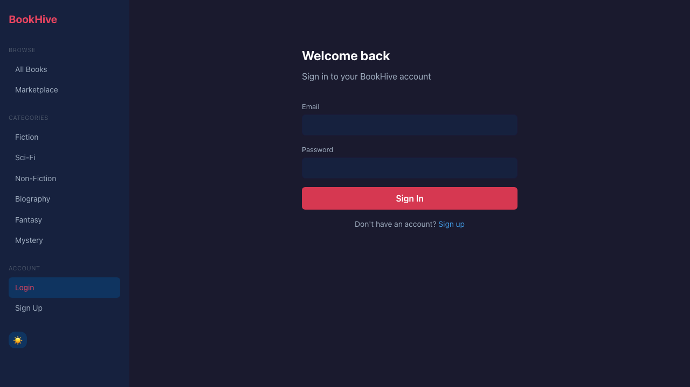
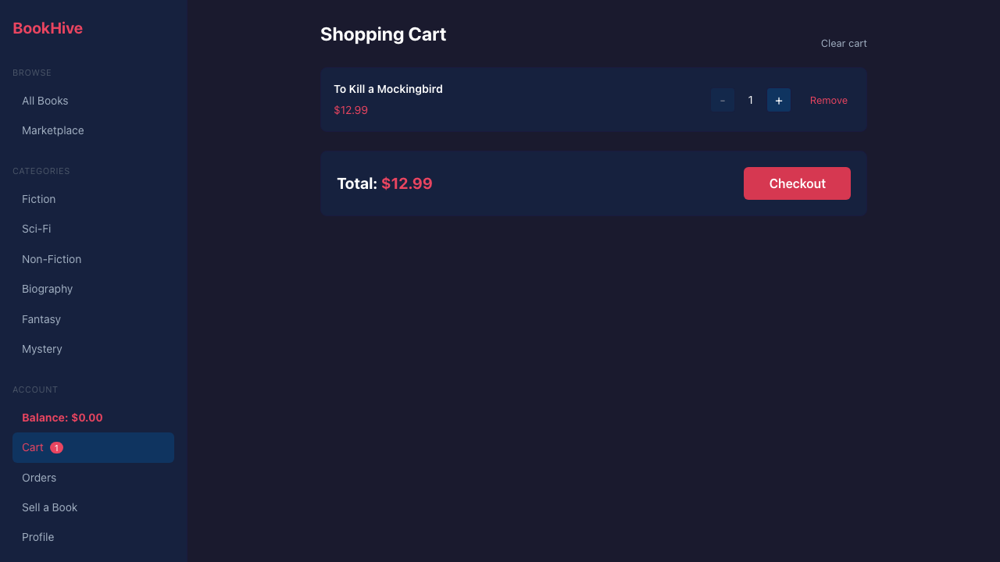

# Bug Report
**Date:** 2026-04-03
**App:** http://localhost:7547 (BookHive)
**Total findings:** 2
**New bugs:** 2 | **Regression candidates:** 0 | **Undocumented quirks:** 0 | **Known but untested:** 0

## Summary by Severity
| Severity | Count | Categories |
|----------|-------|------------|
| Critical | 0     | —          |
| High     | 2     | Error handling |
| Medium   | 0     | —          |
| Low      | 0     | —          |

## Findings

### [BUG-001] Login error message not displayed on invalid credentials
**Severity:** High
**Category:** Error handling / State transition
**Phase discovered:** 1a (Element Probing)
**Page:** LoginPage — `/login`
**Reproduction test:** `tests/e2e/specs/bug-discovery/element-bugs.spec.ts` — `@bug-discovery login error message not displayed on invalid credentials`
**Steps:**
1. Navigate to `/login`
2. Enter invalid email (`wrong@email.com`) and password (`wrongpassword`)
3. Click "Sign In"
4. Observe the page

**Expected:** An error message like "Invalid credentials" should appear on the login page, informing the user that their login attempt failed.

**Actual:** No error message is displayed. The login page silently reloads with empty fields. The user receives zero feedback about why login failed.

**Root Cause:** The global Axios response interceptor in `frontend/src/services/api.js` (lines 8-16) intercepts ALL 401 responses and redirects to `/login`. When the login API returns 401, this interceptor fires *before* the `catch` block in `LoginPage.jsx` can set the error state. The interceptor should exclude the login endpoint from its redirect behavior.

**Screenshot:** 

---

### [BUG-002] Checkout with insufficient balance shows no error message
**Severity:** High
**Category:** Error handling / Data edge case
**Phase discovered:** 1a (Element Probing)
**Page:** CartPage — `/cart`
**Reproduction test:** `tests/e2e/specs/bug-discovery/element-bugs.spec.ts` — `@bug-discovery checkout with insufficient balance shows no error message`
**Steps:**
1. Sign up a new user (starts with $0.00 balance)
2. Add any book to cart (e.g., "To Kill a Mockingbird" at $12.99)
3. Navigate to `/cart`
4. Click "Checkout"
5. Observe the page

**Expected:** An error message should appear informing the user they have insufficient balance to complete the purchase (e.g., "Insufficient balance. You need $12.99 but have $0.00").

**Actual:** The checkout silently fails. The cart stays on screen with no error message. The backend returns a 400 status code but the frontend does not display any feedback to the user.

**Root Cause:** The `CartPage.jsx` checkout handler does not have error handling for failed checkout responses. The `catch` block either doesn't exist or doesn't set a visible error state.

**Screenshot:** 

---

## Coverage Notes
- Pages probed: 10/10 (all application pages)
- Flows tested: 5 (purchase, return, marketplace sell, marketplace buy, cancel listing)
- Categories covered: boundary inputs, state transitions, data edge cases, error handling
- Areas not probed: Rate limiting, concurrent sessions (would require multi-browser setup)
